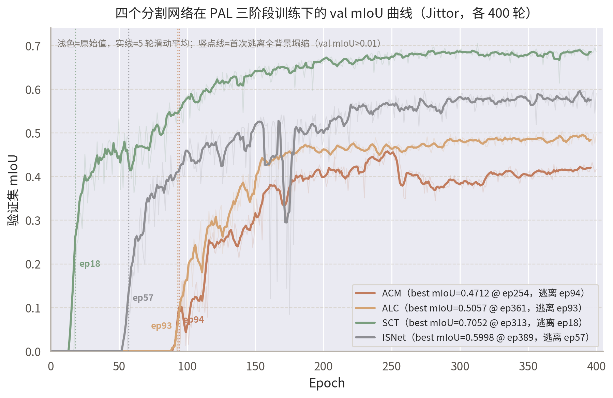
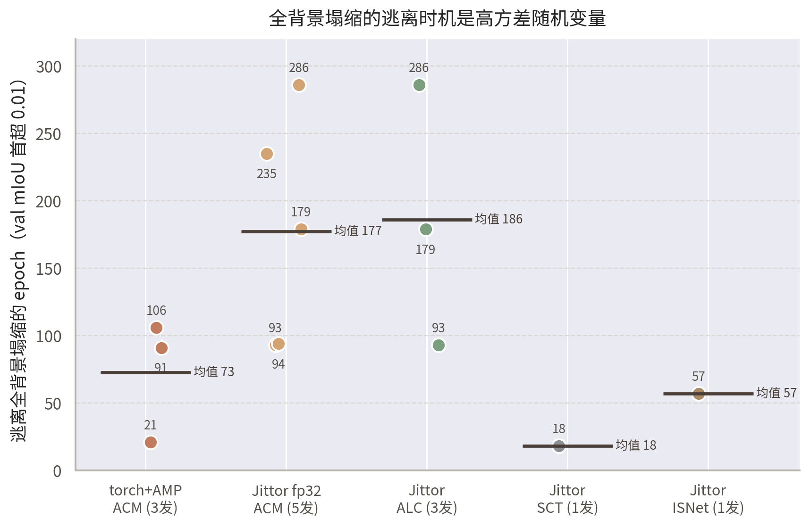
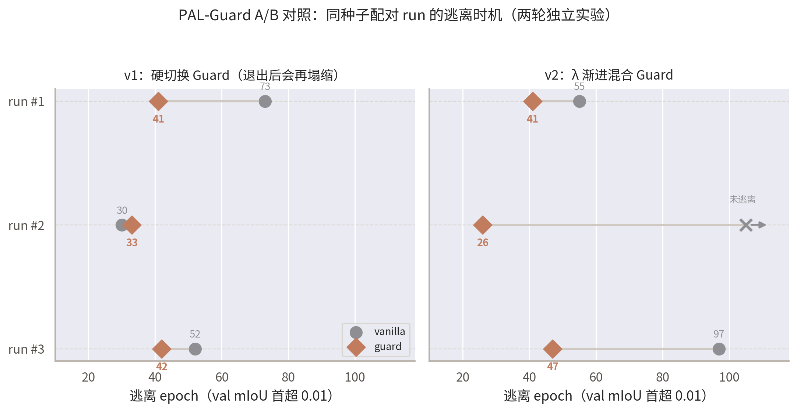
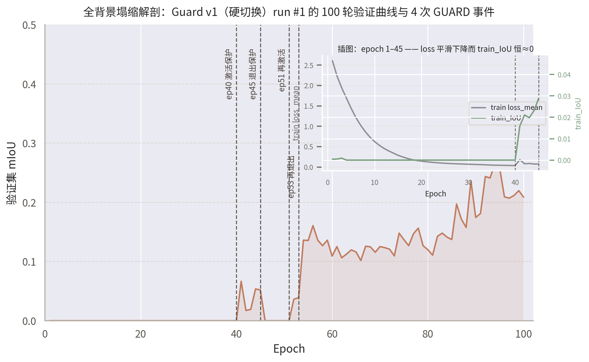

# PAL-Jittor

> **English abstract.** This repository is a faithful [Jittor](https://github.com/Jittor/jittor) re-implementation of **PAL** (*From Easy to Hard: Progressive Active Learning Framework for Infrared Small Target Detection with Single Point Supervision*, ICCV 2025; original PyTorch repo: <https://github.com/YuChuang1205/PAL>). It ports the complete PAL three-stage progressive active-learning pipeline together with four segmentation networks — **ACM** (WACV 2021), **ALCNet** (IEEE TGRS), **SCTransNet** (IEEE TGRS 2024) and **ISNet** (CVPR 2022, with a hand-written pure-Jittor deformable-convolution operator) — and verifies them against the PyTorch reference down to fp64-level structural equivalence (max abs diff 1e-14 ~ 1e-9, zero binarized-pixel disagreement). On top of the migration, we identify and characterize an **"all-background collapse attractor"** in point-supervised training with the edgeSCE loss, and propose **PAL-Guard**, an original anti-collapse mechanism (collapse trigger → balanced-BCE takeover → λ-blended graceful exit) whose A/B behavior is reported honestly, including negative results. This is a learning-oriented reproduction built for the 新芽计划 (New Sprout Program) assessment; all rights of the original PAL code belong to its authors (see [许可与致谢](#许可与致谢)).



---

## 项目简介

[PAL](https://github.com/YuChuang1205/PAL)（ICCV 2025）是面向红外小目标检测（IRSTD）的**单点监督**渐进式主动学习框架：从粗点标签出发，经"预启动 → 增强（难度准入 + 标签自更新）→ 精炼"三阶段，让网络由易到难主动扩充训练池，在只有点标注的条件下逼近全监督水位。

本仓库把 PAL 完整迁移到国产深度学习框架 **Jittor**，内容包括：

- **PAL 机制本体**（`pal/`）：初始伪标签圈定、难度准入、标签自更新、样本迁移——与网络解耦的纯文件/数值逻辑，逐文件、逐字节与 PyTorch 原版对齐；
- **4 个分割网络**（`model/`）：ACM、ALCNet、SCTransNet、ISNet，覆盖 CNN / Transformer / 形状先验三条技术路线；其中 ISNet 的 DCN（可变形卷积）为**纯 Jittor 手写算子**（双线性采样 + reindex gather），与 `torchvision.ops.deform_conv2d` 对拍到 fp64 ≤ 9e-15（前向 + 全部 5 项梯度）；
- **PAL-Guard 抗塌缩机制**（原创，见[专章](#pal-guard抗全背景塌缩机制原创贡献)）：针对迁移过程中发现并得到跨框架证据的"全背景塌缩吸引子"现象设计；
- **完整的对齐测试体系**（`tests/`）：每个网络都有"同源权重灌两版、同输入比输出"的 fp32/fp64 双层验收。

迁移范围决策（为什么从 18 个网络中选这 4 个、为什么裁掉 FFT 频域网络）见 [docs/RESULTS.md](docs/RESULTS.md) 与 docs 内技术报告。

## 主要结果

### 自训结果（SIRST3 + masks_coarse 粗点监督 + PAL，400 epoch，Jittor fp32）

| 网络 | best mIoU | best epoch | 逃离塌缩 epoch | PyTorch 参照 |
|---|---|---|---|---|
| ACM | **0.4712** | 254 | 94 | torch 自训两发 0.4769 / 0.5113；论文 51.51% |
| ALCNet | **0.5057** | 361 | 93 | torch 自训 0.5332；论文 57.11% |
| SCTransNet | **0.7052** | 313 | 18 | 论文 Table 1 无此行（作者后加、未发权重）；**超过论文表中全部 8 个网络**（最高 MSDA-Net 69.38%） |
| ISNet | **0.5998** | 389 | 57 | 论文 Table 1 无此行（同上） |

硬件/环境：AutoDL RTX 4090，jittor 1.3.8.5，AdamW lr=1e-3，bs=16，输入 256×256。全部训练锚点（含逐发日志索引）见 [docs/RESULTS.md](docs/RESULTS.md)。

**对齐情况如实说明：**

- PAL 官方 `train_model.py` **不固定随机种子**，主动学习采样本身随机 → 自训存在种子方差（我们实测 torch 侧 ACM 两发相差 ≈3.4pt）。Jittor 版 ACM 0.4712 落在 torch 自训带（0.4769~0.5113）下沿，ALC 0.5057 距 torch 自训 −2.75pt 亦在该摆幅内 → **训练侧对齐成立**，与论文值的差距主要是"官方权重=多次运行的较优值"。
- **Pd 评测存在系统性 −1.3pt 偏差**（skimage 版本 / 连通域质心实现细节所致，训练循环记录、论文值、我们实测三方数字各异），解读 Pd 时请按 ±1.5pt 容差；IoU / nIoU / Fa 与论文逐位一致（官方权重实测验证，详见 docs/RESULTS.md）。
- SCTransNet 的 0.7052 与 SCTransNet 原论文数字**不可直接对比**（原论文为全监督，此处为 PAL 粗点监督）。

### 逐位对齐证据（同源权重灌两版、同输入比输出，tests/ 实测）

| 网络 | fp64 结构级 max abs diff（阈值 1e-6） | fp32 sigmoid 决策级 diff（阈值 1e-4） | 二值化不一致像素 | 权重映射覆盖率 |
|---|---|---|---|---|
| ACM | 1.066e-09 | ≤ 8.4e-06 | **0** | 267 键：载入 230，跳过 BN `num_batches_tracked` ×37，jittor 侧全覆盖 |
| ALCNet | 1.012e-10 | ≤ 1.5e-05 | **0** | 329 键：载入 282，跳过 ×47，全覆盖 |
| SCTransNet | ≤ 2.4e-07（6 个深监督分支逐一） | < 1e-4 | **0** | 510 键：载入 484，跳过 ×26，全覆盖 |
| ISNet | **4.807e-14**（out）/ 5.851e-14（edge） | ≤ 8.9e-08 | **0** | 551 键：载入 473，跳过 ×78，全覆盖 |

> ACM/ALCNet/ISNet 为打包当日在本仓库 `tests/` 上的复测值；SCTransNet 的对齐夹具超过 5MB 未随仓库分发，其数值为验收记录，可用 `tools/export_sct_torch_refs.py` 重新生成夹具后复现（见[测试](#测试)）。跳过的键全部是 PyTorch BN 特有的 `num_batches_tracked` 计数器（Jittor BN 无此状态，不影响任何计算）。ISNet 的权重映射含 DCN offset 层 / GatedSpatialConv / register_buffer / 原版死模块的键名 1:1 直映，细节见 [docs/PAL_jittor_W5_ISNet迁移报告.md](docs/PAL_jittor_W5_ISNet迁移报告.md)。

## PAL-Guard：抗"全背景塌缩"机制（原创贡献）

### 现象：塌缩吸引子与高方差逃离时机

迁移与自训过程中我们发现：**edgeSCE + 点监督下，网络会先陷入"全背景"塌缩吸引子**——训练 loss 平滑下降，但 train_IoU 恒为 0（网络输出全负即可把 OHEM 后的 loss 压得很低，见下图插图）。逃离该吸引子的时机是**高方差随机变量**，且终点 mIoU 与逃离 epoch 强负相关（有效训练时长被塌缩期侵蚀）：



- PyTorch 原版（torch+AMP，ACM，3 发）：逃离 epoch {21, 91, 106}，全部 ≤ 106；
- Jittor 版（fp32 无 AMP，ACM，5 发）：{93, 94, 179, 235, 286}，2/5 超过 100 轮；ALCNet 3 发同形态；
- 头号系统性嫌疑是 torch 训练全程 AMP(fp16) 的数值噪声加速了对称破缺；深监督的 SCTransNet（逃离 ep18）则提供了"深监督天然抗塌缩"的对照证据。

### 机制：触发 → 平衡 BCE 接管 → λ 渐进退出

`--guard` 开启 GuardController v2 状态机（`off → active → blend → off`，可多次循环）：

1. **触发**：epoch ≥ 40 且最近 5 轮 `max(train_IoU) < 0.005` → 判定陷入塌缩；
2. **接管**：loss 切换为**平衡 BCE**（按 batch 实际正负像素自动设 `pos_weight`，上限 cap=1000），强制打破全背景对称；
3. **退出**：`train_IoU > 0.05` 连续 3 轮 → 进入 10 轮 **λ 渐进混合**（`(1−λ)·edgeSCE + λ·平衡BCE`，λ 从 1.0 线性降到 0.1）平滑回到 edgeSCE；blend 期间若再塌缩，λ 立即回 1 重新接管。

参数可调：`--guard_exit_iou`（默认 0.05）、`--guard_exit_patience`（默认 3）、`--guard_blend_epochs`（默认 10）。`--guard` 默认关闭，关闭时与原训练路径逐位等价（tests/test_guard.py ③ 保证）。

### A/B 实验结论（同种子配对，ACM，各 100 epoch，两轮独立实验共 6 对）




- ✅ **一致加速逃离**：6 对配对中 guard 全部不晚于 vanilla（v2：41<55、47<97、26<永不）；guard-off 时与 vanilla 几乎重合，无副作用；
- ✅ **v2 消除再塌缩**：v1 硬切回 edgeSCE 后 5 轮内会再塌缩（上图中 run#1 的 ep51 再激活）；v2 的 λ 渐进混合实测零再塌缩；
- ❌ **100ep 截断下终点收益未显现（负结果如实写）**：guard 实际触发的配对，100 轮终点 mIoU 低于同种子 vanilla。机制解释：平衡 BCE 阶段学到高召回/高 FA 解，回到 edgeSCE OHEM 后需重构几何，爬升慢于"原生 edgeSCE 逃离"；且 100ep 截断只吃到 15 轮 PAL 增强期；
- 🛡️ **保险价值**：vanilla 出现过全程 100 轮未逃离、终点 0.0000 的实例（塌缩吸引子真实且致命），guard 组 6 发无一全军覆没；
- 📌 **后续工作**：400 epoch 全程的终点收益验证（A/B 各 1 对即可）。另外请注意：**记录实验必须带种子**——种子本身是逃离时机的强变量（带种子 3 发逃离 {30,52,73} vs 无种子 5 发 {93,…,286}）。

完整实验数据（v1/v2 逐发表格）见 [docs/RESULTS.md](docs/RESULTS.md)。

## 安装

```bash
pip install jittor==1.3.8.5 "numpy<2" opencv-python scipy scikit-image albumentations==1.3.0
```

- Linux / Windows 均可（开发期两侧都跑过：AutoDL RTX 4090 + Windows RTX 3070 Laptop）；CUDA 可用时自动用 GPU，纯 CPU 也能跑（慢）；
- `numpy<2` 是硬约束（jittor 1.3.8.5 与 numpy 2.x ABI 不兼容）；`albumentations==1.3.0` 与 PAL 原版保持一致；
- 已知坑（`jt.array(np.float64)` 默认降 fp32、C=1 bias 融合编译错与 `stop_fuse` 处理、fp64 大输入 CPU 超时等）见 [docs/PAL_jittor_W5_ISNet迁移报告.md](docs/PAL_jittor_W5_ISNet迁移报告.md) 第 9 节；
- 两个调试环境变量：`PAL_JT_FORCE_CPU=1` 强制 CPU（确定性回归用）；`PAL_TORCH_PY=/path/to/torch/python` 指定 PyTorch 解释器（测试中的跨框架对拍子进程用，缺失时对应子项自动跳过）。

## 快速开始

### 数据集准备

1. 从 PAL 官方仓库的网盘下载处理好的数据集（含 coarse/centroid 点标签，无需碰 MATLAB）：<https://pan.baidu.com/s/1_QIs9zUM_7MqJgwzO2aC0Q?pwd=1234>（官方说明见 [PAL README](https://github.com/YuChuang1205/PAL)）；
2. 解压后按原版布局放置，使得 `dataset/SIRST3/` 结构如下（train 各 1676 张，val 各 1079 张）：

   ```
   dataset/SIRST3/
   ├── origin/{img, mask, masks_coarse, masks_centroid}/
   ├── val/{img, mask}/
   └── img_idx/
   ```

3. 告诉本仓库数据在哪（二选一）：
   - 把本仓库与原版 PAL 仓库**同级放置**（默认读取 `../PAL/dataset/SIRST3/`）；
   - 或设环境变量 `PAL_ROOT` 指向包含 `dataset/SIRST3/` 的目录：`export PAL_ROOT=/path/to/PAL`（Windows: `set PAL_ROOT=D:/data/PAL`）。

### 训练四个网络

```bash
python train_pal_jt.py --model ACM  --epochs 400      # ACM（默认）
python train_pal_jt.py --model ALC  --epochs 400      # ALCNet
python train_pal_jt.py --model SCT  --epochs 400      # SCTransNet
python train_pal_jt.py --model ISNet --epochs 400     # ISNet
```

常用参数：`--batch_size`（默认 16）、`--lr`（默认 1e-3）、`--pal_total_epochs`（PAL 三阶段调度基准，默认 400）、`--save_dir` / `--pal_workspace`、`--init_from`（从转换后的 torch 权重热启动）。checkpoint 与日志落在 `work_dirs/`。

### PAL-Guard 与随机种子

```bash
python train_pal_jt.py --model ACM --epochs 400 --guard --seed 1001
```

`--guard` 开启抗塌缩保护（默认关）；`--seed` 固定随机种子（**强烈建议实验记录时带上**，见 PAL-Guard 章节的种子敏感性说明）。

### A/B 复现实验

```bash
# Linux / Git Bash；PAL_JT_PY 指定解释器（缺省 python3）
PAL_JT_PY=/path/to/python nohup bash tools/guard_ab.sh > ab_driver.log 2>&1 &
```

顺序跑 6 发（vanilla ×3 + guard ×3，ACM，各 100 epoch，同序号共享种子 1001~1003），日志与 checkpoint 落在 `work_dirs/ab_<时间戳>/`，结尾自动汇总各发逃离 epoch 与末轮 mIoU。测试钩子：`AB_EPOCHS=1 AB_NRUNS=1 AB_EXTRA_ARGS="--limit_init 64 --limit_train 64 --limit_val 4" bash tools/guard_ab.sh` 全链路冒烟。

### 权重转换器（PyTorch → Jittor）

四个网络各有一个转换器（键名 1:1 直映，仅跳过 BN `num_batches_tracked`，jittor 侧参数全覆盖，缺失即报错）：

```bash
python convert_isnet_weights.py            # ISNet（仓库根，CLI）
python model/convert_acm_weights.py        # ACM
python model/convert_alc_weights.py        # ALCNet
python model/convert_sct_weights.py        # SCTransNet
```

产物为 jittor `.pkl`，可用 `--init_from` 喂给训练脚本。torch 侧参考权重/输出的导出器在 `tools/export_*_torch_refs.py`（需在安装了 PyTorch 的 PAL 官方环境 `pal_torch` 中运行）。

## 测试

全部测试在仓库根目录用 jittor 环境运行（Windows 示例解释器路径 `D:/Anaconda/envs/jittor/python.exe`）：

```bash
python tests/test_guard.py          # PAL-Guard 四组验收（数值对拍/状态机/等价性/冒烟），可跟编号跑单组，如 test_guard.py 1
python tests/test_acm.py            # ACM：形状 + fp32 对齐 + fp64 结构等价
python tests/test_alc.py            # ALCNet：同上
python tests/test_isnet.py          # ISNet：形状契约 + fp32/fp64 对齐 + train 模式反向
python tests/test_loss.py           # edgeSCE 与 torch 参考逐位对拍
python tests/test_data_pipeline.py  # 数据管线/指标与 PyTorch 侧一致（需要 SIRST3 数据集）
python tests/test_pal_mechanism.py  # PAL 机制三件套（--t1/--t2/--t3 可分开跑；需要数据集）
python tests/test_sct.py            # SCTransNet（见下方大夹具说明）
```

**大体积夹具（>5MB）未随仓库分发**（`.gitignore` 统一拦截 `*.npz`，`tests/data/` 下小夹具已显式放行）。受影响的测试项与重新生成方法：

| 缺失夹具 | 影响 | 重新生成 |
|---|---|---|
| `sct_torch_init.npz`（45MB）、`sct_ref_random_fp64.npz`（7.9MB） | `tests/test_sct.py` 的对齐项 | 在 torch 环境运行 `python tools/export_sct_torch_refs.py` |
| `train_batch.npz`（21MB） | 无（历史调试产物，现行测试均不引用） | — |

ACM/ALCNet 若要重生成全部参考：`tools/export_torch_refs.py` / `tools/export_alc_torch_refs.py`；ISNet：`tools/export_isnet_torch_refs.py`（内含 DCN offset 非平凡化处理，否则测不到双线性采样路径）。生成器一律写在 torch 环境执行、输出落到 `tests/data/`。

## 目录结构

```
PAL-Jittor/
├── train_pal_jt.py            # PAL 三阶段训练主入口（--model ACM/ALC/SCT/ISNet，--guard，--seed）
├── train_pal_acm_jt.py        # 早期 ACM 专用 PAL 训练脚本（保留作对照）
├── train_acm_jt.py            # ACM 非 PAL 普通训练脚本（保留作对照）
├── convert_isnet_weights.py   # ISNet torch→jittor 权重转换器（CLI）
├── data/                      # SIRST3 Dataset、mean/std 计算、EDT 边缘生成
├── loss/                      # edgeSCE（手写替代 SMP）+ PAL-Guard 平衡 BCE
├── metrics/                   # mIoU / nIoU / Pd / Fa（numpy+skimage，与原版逐位一致）
├── model/                     # acm.py / alc.py / sct.py / isnet.py（含手写 DCN）
│   └── convert_{acm,alc,sct}_weights.py
├── pal/                       # PAL 机制本体（伪标签圈定/难度准入/标签自更新/样本迁移）
├── probes/                    # 迁移期框架 API 探针（interpolate/pool/AMP 等语义对拍）
├── tools/                     # torch 参考导出器、DCN/SCT 双盲探针、guard_ab.sh
├── tests/                     # 验收测试 + data/ 下 <5MB 数值夹具
├── assets/figures/            # README 插图
└── docs/                      # RESULTS.md（全部实验锚点）+ ISNet 迁移技术报告
```

## 引用

若本仓库对你有帮助，请引用原始论文与相关网络（venue/年份以 PAL 原仓库 README 的链接为准）：

```bibtex
@inproceedings{yu2025easy,
  title={From easy to hard: Progressive active learning framework for infrared small target detection with single point supervision},
  author={Yu, Chuang and Zhao, Jinmiao and Liu, Yunpeng and Zhao, Sicheng and Dai, Yimian and Yue, Xiangyu},
  booktitle={Proceedings of the IEEE/CVF International Conference on Computer Vision (ICCV)},
  pages={2588--2598},
  year={2025}
}

@inproceedings{dai2021acm,
  title={Asymmetric contextual modulation for infrared small target detection},
  author={Dai, Yimian and Wu, Yiquan and Zhou, Fei and Barnard, Kobus},
  booktitle={Proceedings of the IEEE/CVF Winter Conference on Applications of Computer Vision (WACV)},
  pages={950--959},
  year={2021}
}

@article{dai2021alcnet,
  title={Attention-guided pyramid context networks for infrared small target detection},
  author={Dai, Yimian and Wu, Yiquan and Zhou, Fei and Barnard, Kobus},
  journal={IEEE Transactions on Geoscience and Remote Sensing},
  volume={60},
  pages={1--11},
  year={2022}
}

@article{yuan2024sctransnet,
  title={SCTransNet: Spatial-channel cross transformer network for infrared small target detection},
  author={Yuan, Yuanbin and others},
  journal={IEEE Transactions on Geoscience and Remote Sensing},
  volume={62},
  pages={1--12},
  year={2024}
}

@inproceedings{zhang2022isnet,
  title={ISNet: Shape matters for infrared small target detection},
  author={Zhang, Mingjin and Zhang, Rui and Yang, Yuxiang and Bai, Haichen and Zhang, Jing and Guo, Jie},
  booktitle={Proceedings of the IEEE/CVF Conference on Computer Vision and Pattern Recognition (CVPR)},
  pages={877--886},
  year={2022}
}

@article{hu2020jittor,
  title={Jittor: a novel deep learning framework with meta-operators and unified graph execution},
  author={Hu, Shi-Min and Liang, Dun and Yang, Guo-Ye and Yang, Guo-Wei and Zhou, Wen-Yang},
  journal={Science China Information Sciences},
  volume={63},
  number={12},
  pages={222103},
  year={2020}
}
```

## 许可与致谢

> **重要声明：本项目为对新芽计划考核的学习性复现（learning-oriented reproduction）。PAL 原代码与论文的一切权利归原作者所有；若原作者要求下架，本仓库将立即执行。**

- 感谢 PAL 作者团队（Yu Chuang、Zhao Jinmiao、Liu Yunpeng、Zhao Sicheng、Dai Yimian、Yue Xiangyu）开源高质量代码与处理好的数据集；
- 感谢 ACM / ALCNet / SCTransNet / ISNet 各网络原作者的工作；
- 感谢新芽计划提供本次复现考核机会；
- 本仓库中 Jittor 迁移代码与 PAL-Guard 机制为复现者所加，以学习与科研交流为目的发布，不用于商业用途；原 PAL 仓库采用 Apache 2.0 许可，衍生部分遵循同等精神。
